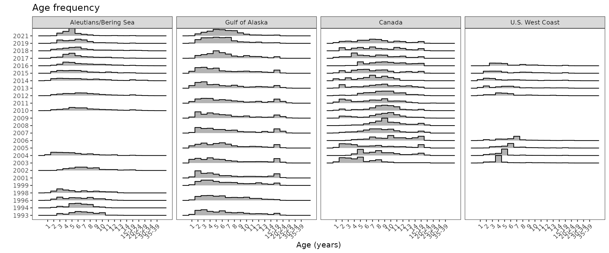
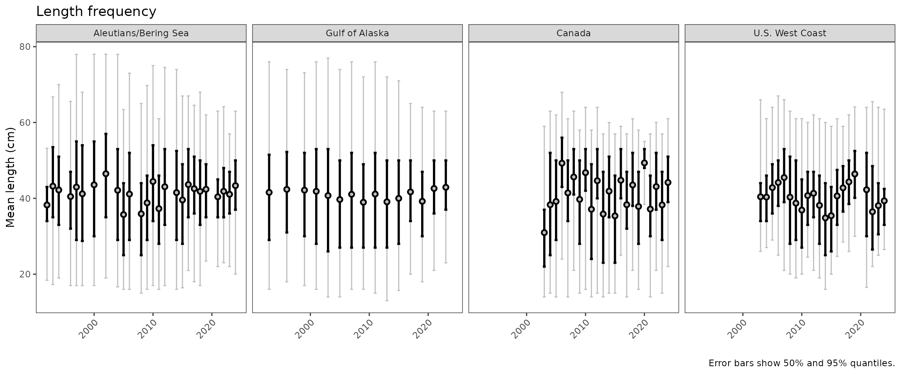
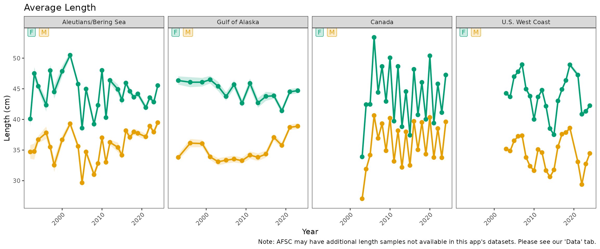
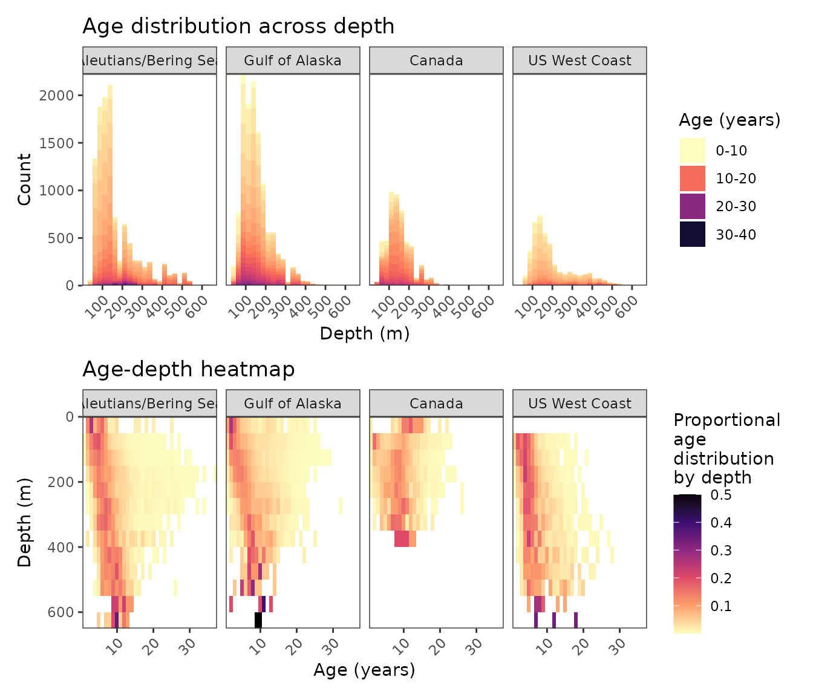

# Plotting biology

For these plots we will need biological data stored in three data frames
in the `fishyplots` package which we can combine with `bind_rows` from
`dplyr`.

``` r
library(fishyplots)
library(utils)
library(dplyr)
```

``` r
data("nwfsc_bio")
data("afsc_bio")
data("pbs_bio")
all_data <- bind_rows(afsc_bio, nwfsc_bio, pbs_bio)
```

These functions take in any number of subregions (default all regions)
and one lowercase species common or scientific name. Note that not all
species occur in all regions, and “no data” messages or plots will be
displayed. If multiple regions are selected, plots will be faceted by
region by default.

``` r
unique(all_data$survey)
#> [1] "AK GULF" "AK BSAI" "NWFSC"   "PBS"
head(unique(all_data$common_name))
#> [1] "atka mackerel"       "pacific ocean perch" "southern rock sole" 
#> [4] "northern rockfish"   "flathead sole"       "shortraker rockfish"
```

Once you have chosen your desired region(s) and species, you can call
the functions. Many biological plotting functions have a few main
arguments to input `data`, `subregions`, and `species` to be plotted. If
available, `by_sex` will differentiate data by sex if not done already.
Since some species have limited biological data, some of the facets may
display a “no data” message. If you wish to drop these subplots with
missing data, set `facet_all` to FALSE.

## Age Frequency

In order to manage the right skew caused by older groundfish, ages are
binned at a certain age percentile. The argument `cutoff` can be used to
specify the age percentile at which the graph will start binning (it is
automatically set at 0.95). You may also choose to set `by_sex` to TRUE
if you want to differentiate by sex.

``` r
age_frequency(data = all_data, 
              subregions = c("PBS", "NWFSC", "AK BSAI", "AK GULF"), 
              species = "arrowtooth flounder")
```



## Length Frequency

The following function generates a length frequency plot. If you want to
instead see a histogram of lengths by year you may choose to set the
`time_series` argument to FALSE (although in doing so you must subset
all_data to the desired regions before calling the function).

``` r
length_frequency(data = all_data, 
                 subregions = c("PBS", "NWFSC", "AK BSAI", "AK GULF"), 
                 species = "arrowtooth flounder")
```



``` r

length_frequency(data = nwfsc_bio, 
                 subregions = "NWFSC", 
                 species = "arrowtooth flounder",
                 time_series = FALSE)
#> Warning: Removed 1 row containing non-finite outside the scale range
#> (`stat_bin()`).
```


## Average Length

We also have a function that provides mean length over time
differentiated by sex.

``` r
length_ts(data = all_data, 
          subregions = c("PBS", "NWFSC", "AK BSAI", "AK GULF"), 
          species = "arrowtooth flounder")
```



## Age - Depth

The next function plots both a histogram and heatmap for the age-depth
relationship. Sex differentiation with `by_sex` works best when just
looking at one region, although looking at this across all regions is
also an option.

``` r
plot_age_depth(data = all_data, 
               subregion = c("AK BSAI", "AK GULF", "PBS", "NWFSC"), 
               species = "arrowtooth flounder")
```



``` r
plot_age_depth(data = all_data,
               subregion = "NWFSC", 
               species = "arrowtooth flounder",
               by_sex = TRUE)
```


## Length - Depth

You can make the same types of graphs for the length-depth relationship
as well. Again, the `by_sex` argument can be specified here.

``` r
plot_length_depth(data = all_data,
                  subregions = "NWFSC",
                  species = "sablefish")
```


## Growth

To make growth plots, this function internally uses prediction data
formulated from the von Bertalanffy function that is stored in the
`fishyplots` package.

``` r
data(vb_predictions)
```

The function takes in the biological data, the desired region(s), and 1
species. The argument `facet_all` will automatically include all
subregions regardless of missing data, but can be turned off when set to
FALSE.

``` r
plot_growth(data = all_data,
            subregions = c("AK BSAI", "AK GULF", "NWFSC", "PBS"),
            species = "arrowtooth flounder")
```


## Length - Weight

Finally, we can also plot the length-weight relationship. Similat to the
growth function, this function internally uses log-log regression
prediction data from the `fishyplots` package.

``` r
data(lw_predictions)
```

The argument `subset` defaults TRUE to plot a random subset of 10000
points per region for quicker plotting speed. To see all available data
points, set as FALSE.

``` r
length_weight(data = all_data,
              species = "arrowtooth flounder",
              subset = TRUE)
#> Note: Plotting a random n = 10000 subset of arrowtooth flounder. Model values not impacted.
```


