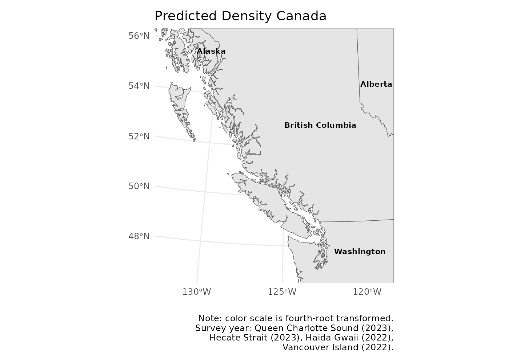

# Mapping density

Density prediction data is stored in the fishyplots package. There are
three data frames for each region, which we can combine with `bind_rows`
from `dplyr`.

``` r
library(fishyplots)
library(dplyr)
```

``` r
data(predictions_afsc)
data(predictions_pbs)
data(predictions_nwfsc)
data <- bind_rows(predictions_afsc, predictions_pbs, predictions_nwfsc)
```

The function takes in these predictions, specified region(s), and 1
species. For instance, we can take a look at arrowtooth flounder
densities in all regions. Note that if you select all regions but a
species does not occur in all of them, empty base maps will still show
up.

``` r
fishmap(data, c("AK BSAI", "AK GULF", "PBS", "NWFSC"), "arrowtooth flounder")
#> Reading ne_50m_admin_1_states_provinces_lakes.zip from naturalearth...
#> Reading ne_50m_admin_1_states_provinces_lakes.zip from naturalearth...
```


Alternatively, you may just want to look at one region.

``` r
fishmap(data, "PBS", "dover sole")
#> Reading ne_50m_admin_1_states_provinces_lakes.zip from naturalearth...
#> Reading ne_50m_admin_1_states_provinces_lakes.zip from naturalearth...
```


